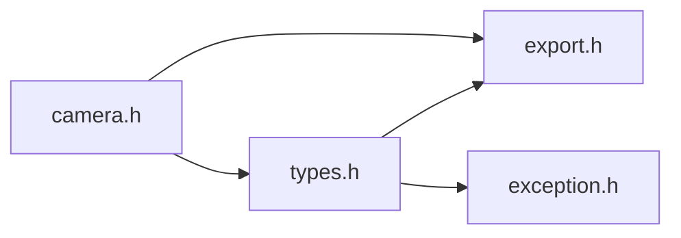
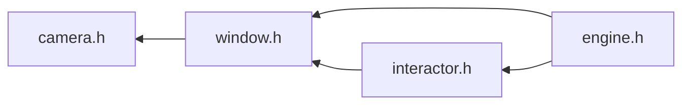

# File camera.h

![][C++]

**Location**: `camera.h`


## Classes

* [f3d::camera\_state\_t](structf3d_1_1camera__state__t.md)
* [f3d::camera](classf3d_1_1camera.md)

## Namespaces

* [f3d](namespacef3d.md)

## Includes

* export.h
* [types.h](types_8h.md)





## Included by

* [window.h](window_8h.md)





## Source


```cpp
#ifndef f3d_camera_h
#define f3d_camera_h

#include "export.h"
#include "types.h"

#include <array>
#include <string>

namespace f3d
{
struct F3D_EXPORT camera_state_t
{
  point3_t position = { 0., 0., 1. };
  point3_t focalPoint = { 0., 0., 0. };
  vector3_t viewUp = { 0., 1., 0. };
  angle_deg_t viewAngle = 30.;
};

class F3D_EXPORT camera
{
public:

  virtual camera& setPosition(const point3_t& pos) = 0;
  [[nodiscard]] virtual point3_t getPosition() const = 0;
  virtual void getPosition(point3_t& pos) const = 0;
  virtual camera& setFocalPoint(const point3_t& foc) = 0;
  [[nodiscard]] virtual point3_t getFocalPoint() const = 0;
  virtual void getFocalPoint(point3_t& foc) const = 0;
  virtual camera& setViewUp(const vector3_t& up) = 0;
  [[nodiscard]] virtual vector3_t getViewUp() const = 0;
  virtual void getViewUp(vector3_t& up) const = 0;
  virtual camera& setViewAngle(const angle_deg_t& angle) = 0;
  [[nodiscard]] virtual angle_deg_t getViewAngle() const = 0;
  virtual void getViewAngle(angle_deg_t& angle) const = 0;
  virtual camera& setState(const camera_state_t& state) = 0;
  [[nodiscard]] virtual camera_state_t getState() const = 0;
  virtual void getState(camera_state_t& state) const = 0;


  virtual camera& dolly(double val) = 0;
  virtual camera& pan(double right, double up, double forward = 0) = 0;
  virtual camera& zoom(double factor) = 0;
  virtual camera& roll(angle_deg_t angle) = 0;
  virtual camera& azimuth(angle_deg_t angle) = 0;
  virtual camera& yaw(angle_deg_t angle) = 0;
  virtual camera& elevation(angle_deg_t angle) = 0;
  virtual camera& pitch(angle_deg_t angle) = 0;


  virtual camera& setCurrentAsDefault() = 0;

  virtual camera& resetToDefault() = 0;

  virtual camera& resetToBounds(double zoomFactor = 0.9) = 0;

protected:
  camera() = default;
  virtual ~camera() = default;
  camera(const camera&) = delete;
  camera(camera&&) = delete;
  camera& operator=(const camera&) = delete;
  camera& operator=(camera&&) = delete;
};
}

#endif
```


[public]: https://img.shields.io/badge/-public-brightgreen (public)
[C++]: https://img.shields.io/badge/language-C%2B%2B-blue (C++)
[const]: https://img.shields.io/badge/-const-lightblue (const)
[protected]: https://img.shields.io/badge/-protected-yellow (protected)
[static]: https://img.shields.io/badge/-static-lightgrey (static)
[private]: https://img.shields.io/badge/-private-red (private)