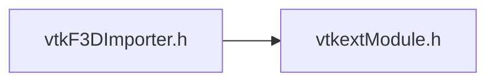

# File vtkF3DImporter.h

![][C++]

**Location**: `vtkF3DImporter.h`


## Classes

* [vtkF3DImporter](classvtkF3DImporter.md)

## Includes

* vtkextModule.h





## Source


```cpp


#ifndef vtkF3DImporter_h
#define vtkF3DImporter_h

#include "vtkextModule.h"

#include <vtkImporter.h>
#include <vtkVersion.h>

class vtkInformationIntegerKey;

class VTKEXT_EXPORT vtkF3DImporter : public vtkImporter
{
public:
  static vtkInformationIntegerKey* ACTOR_IS_ARMATURE();

#if VTK_VERSION_NUMBER >= VTK_VERSION_CHECK(9, 3, 20240707)
  bool UpdateAtTimeValue(double timeValue) override;
#else
  virtual bool UpdateAtTimeValue(double timeValue);
  void UpdateTimeStep(double timeValue) override;
#endif

#if VTK_VERSION_NUMBER < VTK_VERSION_CHECK(9, 4, 20250507)
  enum class AnimationSupportLevel : unsigned char{ NONE, UNIQUE, SINGLE, MULTI };

  virtual AnimationSupportLevel GetAnimationSupportLevel()
  {
    return AnimationSupportLevel::MULTI;
  }
#endif

  void SetFailureStatus();
};

#endif
```


[C++]: https://img.shields.io/badge/language-C%2B%2B-blue (C++)
[public]: https://img.shields.io/badge/-public-brightgreen (public)
[private]: https://img.shields.io/badge/-private-red (private)
[static]: https://img.shields.io/badge/-static-lightgrey (static)
[protected]: https://img.shields.io/badge/-protected-yellow (protected)